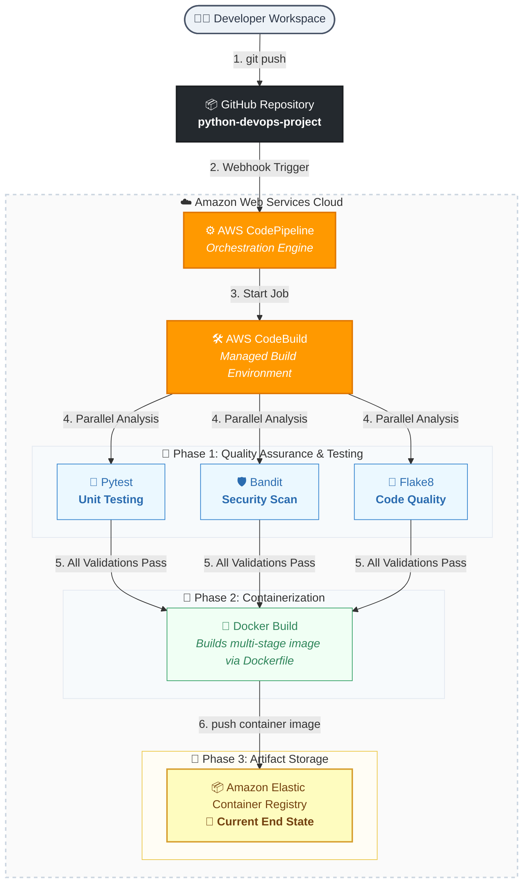

Entire Project Oveview
1. Developed a Flask application.
2. Created unit tests using Pytest.
3. Performed security scanning using Bandit.
4. Performed code quality checks using Flake8.
5. Containerized the application using Docker.
6. Stored images in Amazon ECR.
7. Deployed containers to Amazon ECS.
8. Automated build and deployment using AWS CodePipeline and CodeBuild.

                   Developer
                       |
                       | git push
                       v
              +------------------+
              |      GitHub      |
              | python-devops-   |
              |     project      |
              +------------------+
                       |
                       | Trigger
                       v
              +------------------+
              |  CodePipeline    |
              +------------------+
                       |
                       v
              +------------------+
              |   CodeBuild      |
              +------------------+
                       |
        --------------------------------
        |              |              |
        v              v              v
   +---------+   +----------+   +----------+
   | Pytest  |   | Bandit   |   | Flake8   |
   | Testing |   | Security |   | Quality  |
   +---------+   +----------+   +----------+
                       |
                       v
              +------------------+
              | Docker Build     |
              | Dockerfile       |
              +------------------+
                       |
                       v
              +------------------+
              | Amazon ECR       |
              | Container Image  |
              +------------------+
                       |
                       | (Current End State)
                       v
             Docker Image Stored

| Service      | Purpose                               |
| ------------ | ------------------------------------- |
| GitHub       | Stores your source code               |
| CodePipeline | Orchestrates the CI/CD workflow       |
| CodeBuild    | Executes build and test stages        |
| Pytest       | Runs unit tests                       |
| Bandit       | Security vulnerability scanning       |
| Flake8       | Code quality/linting checks           |
| Docker       | Packages application into a container |
| ECR          | Stores Docker images                  |





# AWS ECS Deployment Steps

## 1. Create an ECR Repository

* Created an Amazon ECR repository named `python-devops-repo`.
* Used ECR as the container image registry.

## 2. Build Docker Image

* Created a Dockerfile for the Python Flask application.
* Built the Docker image locally.

```bash
docker build -t python-devops-repo .
```

## 3. Authenticate Docker with ECR

* Logged in to Amazon ECR using AWS CLI.

```bash
aws ecr get-login-password --region eu-north-1 | docker login --username AWS --password-stdin <account-id>.dkr.ecr.eu-north-1.amazonaws.com
```

## 4. Tag and Push Image to ECR

```bash
docker tag python-devops-repo:latest <account-id>.dkr.ecr.eu-north-1.amazonaws.com/python-devops-repo:latest

docker push <account-id>.dkr.ecr.eu-north-1.amazonaws.com/python-devops-repo:latest
```

* Verified that the image was successfully uploaded to ECR.

## 5. Create ECS Cluster

* Created an ECS Cluster named `python-devops-cluster`.
* Selected AWS Fargate as the launch type.

## 6. Create Task Definition

* Created a Task Definition for the application.
* Configured:

  * Launch Type: Fargate
  * CPU: 1 vCPU
  * Memory: 3 GiB
  * Container Image: ECR image URI
  * Container Port: 5000

## 7. Configure Container Port Mapping

```text
5000:5000
80:80
```

* Flask application configured to listen on:

```python
app.run(host="0.0.0.0", port=5000)
```

## 8. Create ECS Service

* Created an ECS Service using the task definition.
* Desired Tasks: 1
* Launch Type: Fargate
* Enabled public networking for internet access.

## 9. Deploy Application

* ECS pulled the container image directly from ECR.
* Started the container successfully.
* Verified task status as RUNNING.

## 10. Verify Logs

* Checked ECS task logs.
* Confirmed Flask application started successfully.

```text
Running on all addresses (0.0.0.0)
Running on http://127.0.0.1:5000
```

## 11. Configure Security Group

* Added inbound rule to allow application traffic.

| Type       | Protocol | Port |
| ---------- | -------- | ---- |
| Custom TCP | TCP      | 5000 |

Source:

```text
0.0.0.0/0
```

## 12. Access Application

* Retrieved ECS task public IP.
* Accessed application using:

```text
http://<public-ip>:5000
```

## Outcome

* Container image stored in Amazon ECR.
* Application deployed on Amazon ECS Fargate.
* ECS service manages task availability and container execution.
* Security group configured to allow external access to the application.
